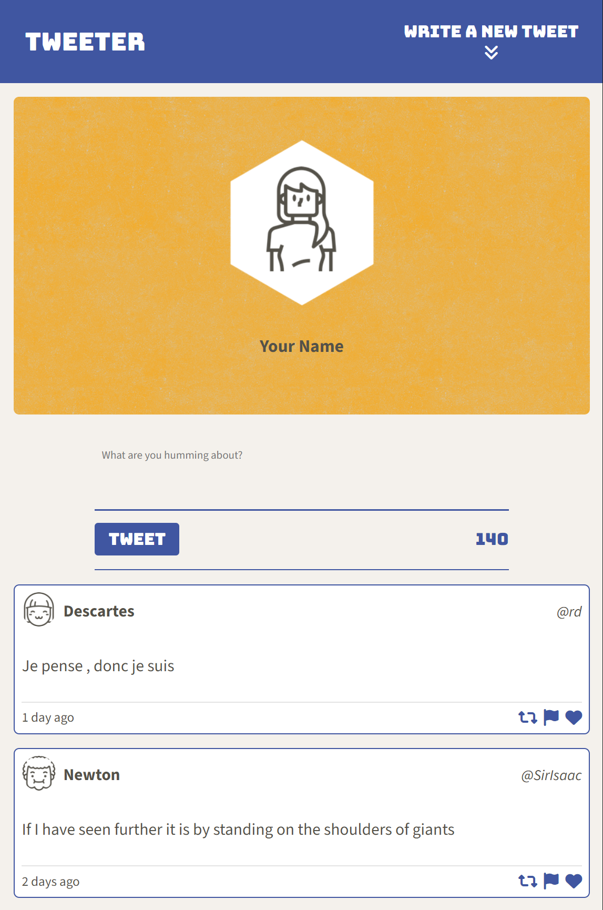
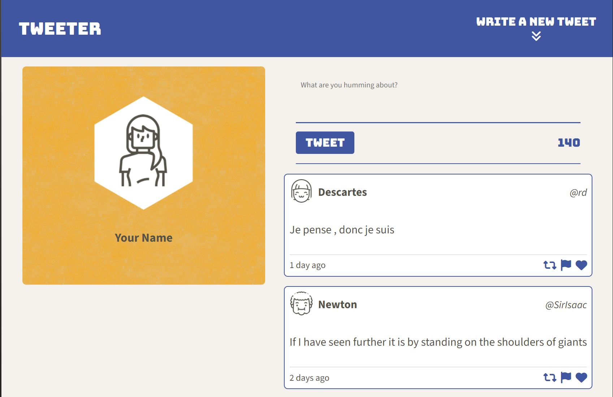
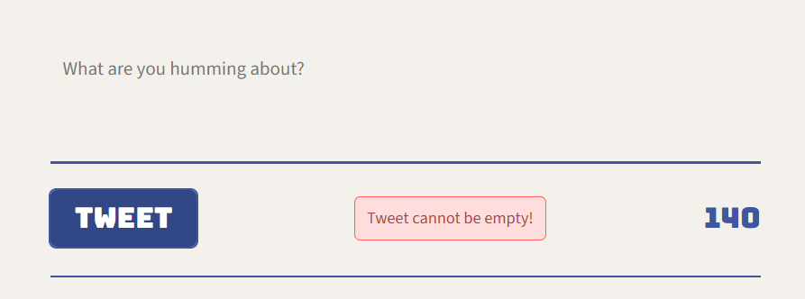

# Tweeter Project

Tweeter is a simple, single-page Twitter clone.

This repository is the starter code for the project: Students will fork and clone this repository, then build upon it to practice their HTML, CSS, JS, jQuery and AJAX front-end skills, and their Node, Express back-end skills.

## Table of Contents

- [Getting Started](#getting-started)
- [Features](#features)
- [Technical Details](#technical-details)
- [Dependencies](#dependencies)
- [Screenshots](#screenshots)

## Getting Started

1. Clone this repository to your local machine:

```bash
git clone https://github.com/ArcaneCipher/tweeter
```

2. Navigate to the project directory:

```bash
cd tweeter
```

3. Install the project dependencies:

```bash
npm install
```

4. Start the server:

```bash
npm run local
```

5. Open your browser and go to:

```bash
http://localhost:8080/
```

## Features

### Core Functionality

- Dynamic Tweet Posting:
  - Users can create tweets of up to 140 characters.
  - Tweets are submitted asynchronously and appear instantly at the top of the feed.

- Error Handling:
  - Displays validation errors when the tweet exceeds 140 characters or is empty.
  - Errors are animated to slide into view for better user experience.

- Responsive Design:
  - Adapts to screen sizes:
    - Mobile view (single-column layout).
    - Desktop view (two-column layout with profile information on the left and tweet-related content on the right).

### User Interaction

- Navigation Bar Compose Button:
  - Toggles the visibility of the tweet form with smooth animations.
  - Auto-focuses the textarea when the form is displayed.

- Scroll-to-Top Button:
  - Appears in the bottom-right corner when the user scrolls down.
  - Clicking it scrolls the page to the top and reveals the tweet form, ready for input.

- Dynamic Character Counter:
  - Updates as the user types.
  - Turns red if the character limit is exceeded.

- Tweet Display
  - Displays tweets in reverse chronological order.
  - Each tweet includes:
    - User's avatar, name, and handle.
    - Tweet content.
    - Timestamp indicating how long ago the tweet was created.
    - Interactive icons (flag, retweet, heart).

## Technical Details

### Frontend

- HTML & CSS:
  - Semantic, accessible, and responsive layout using Flexbox.
  - External fonts (Source Sans Pro and Bungee) for styling.

- JavaScript & jQuery:
  - DOM manipulation for dynamic tweet rendering.
  - AJAX for asynchronous data fetching and submission.

- AJAX:
  - Fetches tweets from the backend server.
  - Submits new tweets and refreshes the feed dynamically.

### Backend

- Pre-built Backend:
  - The backend server handles tweet storage and retrieval using a simple API.
  - All interactions are through AJAX requests.

## Dependencies

- Node.js (v5.10.x or above)
- Express
- Body-parser
- Chance
- md5

## Screenshots

### Mobile View



### Desktop View



### Error Handling



## Future Enhancements

- Implement a "like" feature for tweets.
- Add user authentication for personalized profiles.
- Introduce infinite scrolling for the tweet feed.

## Acknowledgements

Tweeter was developed as part of a learning exercise to practice front-end development with modern web technologies and workflows.
